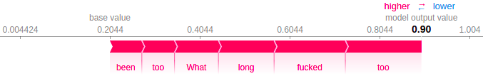
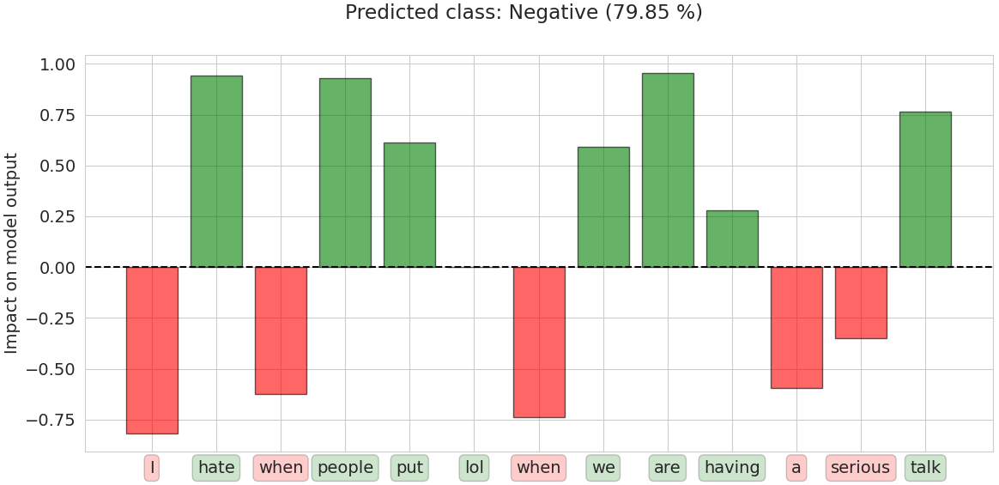

# TransSHAP
(a, b) Interpreting the BERT model with explanation methods LIME (https://github.com/marcotcr/lime) and SHAP (https://github.com/slundberg/shap) using their visualization approach, and (c) generating explanations with Kernel SHAP and using our visualization approach (TransSHAP visualizer) to make it more intuitive for textual data.

### Load model / test texts
```python
from transformers import BertTokenizer, BertForSequenceClassification
import numpy as np
import pandas as pd
from nltk.tokenize import TweetTokenizer
import random
import logging
logging.basicConfig(format='%(asctime)s - %(message)s', datefmt='%d-%b-%y %H:%M:%S')
logging.getLogger().setLevel(logging.INFO)

class SCForShap(BertForSequenceClassification):
    def __init__(self, config):
        super().__init__(config)
    def forward(self, input_ids=None, attention_mask=None, token_type_ids=None, position_ids=None, head_mask=None, inputs_embeds=None, labels=None,):
        output = super().forward(input_ids, attention_mask, token_type_ids, position_ids, head_mask, inputs_embeds, labels)
        return output[0]

# Load pre-trained model tokenizer
pretrained_model = "./models/en_balanced_bertbase-g512-epochs3/"
tokenizer = BertTokenizer.from_pretrained(pretrained_model, do_lower_case=False)
model = SCForShap.from_pretrained(pretrained_model)

# Test texts
t1 = "Why is it that 'fire sauce' isn't made with any real fire? Seems like false advertising." #neutral
t2 = "Being offensive isn't illegal you idiot." #negative
t3 = "Loving the first days of summer! <3" #positive
t4 = "I hate when people put lol when we are having a serious talk ."   #negative
t5 = "People are complaining about lack of talent. Takes a lot of talent to ignore objectification and degradation #MissAmerica" #neutral
t6 = "@Lukc5SOS bc you're super awesome😉" #positive
t7 = "RT @JakeBoys: This show is amazing! @teenhoot family are insane 😍" #positive
t8 = "So kiss me and smile for me 😊💗 http://t.co/VsRs8KUmOP"
t9 = "Shit has been way too fucked up, for way too long. What the fuck is happening" #negative
texts = [t1, t2, t3, t4, t5, t6, t7, t8, t9]

# Bag of words (vocabulary)
train_data = pd.read_csv("./models/English_tweet_label.csv")
train_data = list(train_data["Tweet text"])
tknzr = TweetTokenizer()
bag_of_words = set([xx for x in train_data for xx in tknzr.tokenize(x)])
```

### a) Explanation method LIME
```python
from lime.lime_text import LimeTextExplainer
from explainers.LIME_for_text import LIMExplainer

predictor = LIMExplainer(model, tokenizer)
label_names = ["Positive", "Neutral", "Negative"]
explainer = LimeTextExplainer(class_names=label_names, split_expression=predictor.split_string)

to_use = texts[-2:]
for i, example in enumerate(to_use):
    logging.info(f"Example {i+1}/{len(to_use)} start")
    temp = predictor.split_string(example)
    exp = explainer.explain_instance(text_instance=example, classifier_fn=predictor.predict, num_features=len(temp))
    logging.info(f"Example {i + 1}/{len(to_use)} done")
    words = exp.as_list()
    #sum_ = 0.6
    #exp.local_exp = {x: [(xx, yy / (sum(hh for _, hh in exp.local_exp[x])/sum_)) for xx, yy in exp.local_exp[x]] for x in exp.local_exp}
    exp.show_in_notebook(text=True, labels=(exp.available_labels()[0],))
```
LIME explanations for positive (top) and negative (bottom) sentiment:


### b) Explanation method SHAP
```python
import shap
from explainers.SHAP_for_text import SHAPexplainer
logging.getLogger("shap").setLevel(logging.WARNING)
shap.initjs()

words_dict = {0: None}
words_dict_reverse = {None: 0}
for h, hh in enumerate(bag_of_words):
    words_dict[h + 1] = hh
    words_dict_reverse[hh] = h + 1

predictor = SHAPexplainer(model, tokenizer, words_dict, words_dict_reverse)
train_dt = np.array([predictor.split_string(x) for x in np.array(train_data)])
idx_train_data, max_seq_len = predictor.dt_to_idx(train_dt)

explainer = shap.KernelExplainer(model=predictor.predict, data=shap.kmeans(idx_train_data, k=50))

texts_ = [predictor.split_string(x) for x in texts]
idx_texts, _ = predictor.dt_to_idx(texts_, max_seq_len=max_seq_len)

to_use = idx_texts[-1:]
shap_values = explainer.shap_values(X=to_use, nsamples=64, l1_reg="aic")

len_ = len(texts_[-1:][0])
d = {i: sum(x > 0 for x in shap_values[i][0, :len_]) for i, x in enumerate(shap_values)}
m = max(d, key=d.get)
print(" ".join(texts_[-1:][0]))
shap.force_plot(explainer.expected_value[m], shap_values[m][0, :len_], texts_[-1:][0])
```
SHAP explanations for positive (top) and negative (bottom) sentiment:



### c) Kernel SHAP and TransSHAP visualizer
```python
from explainers import visualize_explanations

text = texts_[-1:]
to_use = idx_texts[-1:].reshape(1, -1)
f = predictor.predict(to_use)
pred_f = np.argmax(f[0])

visualize_explanations.joint_visualization(text[0], shap_values[pred_f][0, :len(text[0])], ["Positive", "Neutral", "Negative"][int(pred_f)], f[0][pred_f], -1)
```
An example of our approach to visualization of prediction explanations for negative sentiment:



If you use this work, please cite KOKALJ, Enja, ŠKRLJ, Blaž, LAVRAČ, Nada, POLLAK, Senja, ROBNIK ŠIKONJA, Marko. BERT meets Shapley : extending SHAP explanations to transformer-based classifiers. In: TOIVONEN, Hannu (ed.), BOGGIA, Michele (ed.). EACL hackashop on news media content analysis and automated report generation : proceedings. Stroudsburg: Association for Computational Linguistics = ACL, pp. 16-21. https://www.aclweb.org/anthology/2021.hackashop-1.3.pdf.
